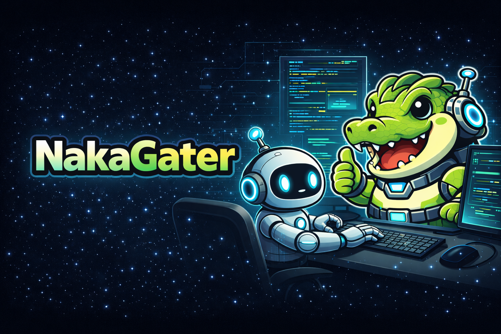

  

  AI-Driven Development Practitioner 
  AI駆動開発 実践者

---

## 🚀 About / 自己紹介

I practice **AI-Driven Development** in real engineering environments.  
実務の中で **AI駆動開発** を実践しています。

Not just using AI tools —  
but designing systems where AI becomes part of the development workflow.  

単にAIを使うのではなく、  
AIを開発プロセスの一部として設計することを目指しています。

I focus on:  
私が取り組んでいるテーマ：

- 🤖 Agent-based development systems  
  エージェントベース開発設計
- 🧠 Spec-driven engineering  
  Spec駆動開発
- 🔁 Automated Dev loops  
  自動化された開発ループ設計
- ⚙️ GitHub × AI workflow design  
  GitHub × AI ワークフロー設計

> “Don't just use AI. Build with AI.”  
> 「AIを使う」ではなく「AIと開発する」

---

## 🛠 Tech Stack / 技術スタック

### Frontend
- React / TypeScript
- Vite
- Nextjs
- UI設計

### Backend
- Spring Boot (Kotlin)
- Node.js (AWS Lambda)
- REST / OIDC / 認証設計
- セッション & トークン設計

### Infrastructure
- AWS (ECS / Lambda / DynamoDB / S3 / CloudFront)
- Terraform / SAM
- CI/CD (GitHub Actions)
- 開発自動化パイプライン設計

---

## 🤖 AI × Engineering

Currently exploring:  
現在探究していること：

- Copilot Agent architecture  
- Sub-agent orchestration  
- Spec → Plan → Implement → Review loops  
- AI-assisted PR review systems  
- AI workflow governance  

I believe the future of engineering is:  
これからのエンジニアリングは

> Human intention × AI execution  
> 人間の意図 × AIの実行力

---

## 🧪 What I'm Building / 取り組んでいること

- 🐊 NakaGater Agent System  
- AI-driven GitHub workflows  
- Spec駆動開発パイプライン
- 開発生産性ダッシュボード
- AIネイティブな開発プロセス設計

---

## 📌 Philosophy / 思想

Engineering is evolving.  
エンジニアリングは進化しています。

AI is not just a tool layer.  
It is becoming part of the architecture.  

AIは単なるツールではなく、  
アーキテクチャの一部になりつつあります。

I'm experimenting at the edge —  
designing development systems where humans define intent and AI executes structure.  

人間が意図を定義し、  
AIが構造を実行する開発システムを実験しています。

---

## 🌱 Currently Learning / 学習中

- Advanced agent orchestration  
- AI-native software architecture  
- Automated governance patterns  
- Dev productivity optimization  
- AI-driven team enablement  

---

  🐊 AI × Engineering × Execution 🐊

